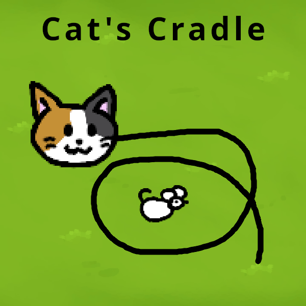

# cats-cradle
A game made in one day for experimentaljams.com, the theme was loop.  

## Compiling
Simply clone the repository and run `./build.sh` or `build.bat` if you are on windows. The game files will be copied to ./build/bin/
